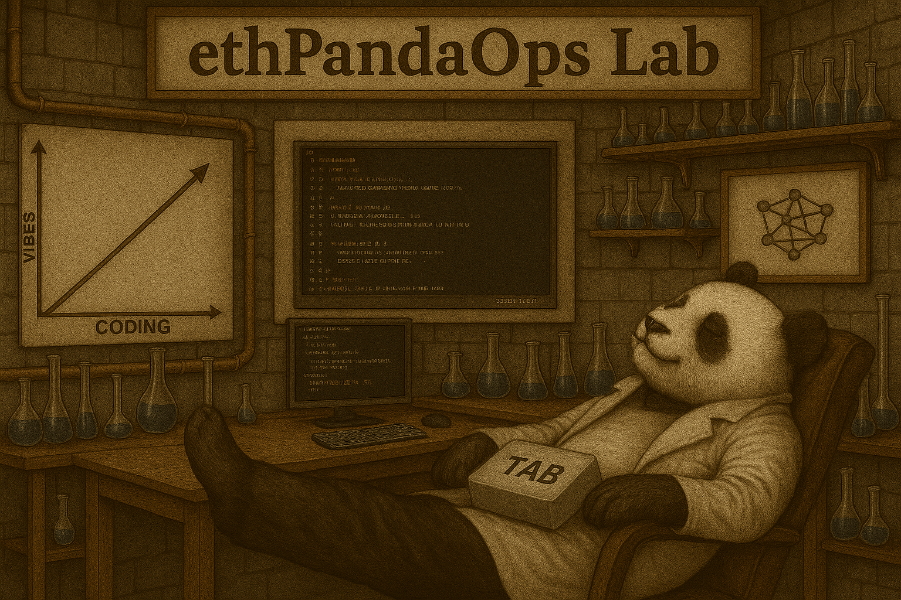

# ethPandaOps Lab



The ethPandaOps Lab is our high velocity, experimental platform for exploring new ideas and concepts in the Ethereum ecosystem. The Lab aims to provide insights that are not viable with standard observability tools like Grafana or Prometheus.

The codebase is built with a focus on developer experience and integration with LLM's to quickly iterate on ideas. 

## Features

- **Multi-Network Support**: Data collection and analytics for multiple Ethereum networks
- **Xatu Integration**: Insights from Xatu, an Ethereum event collector and metrics exporter

## Architecture

The application consists of:

```
├── backend/                # Go implementation (main codebase)
│   ├── pkg/                # Core packages
│   │   ├── api/            # API service (client-facing)
│   │   ├── server/         # SRV service (business logic, data processing)
│   │   │   ├── internal/   # Internal server components
│   │   │   │   ├── grpc/   # gRPC server implementation
│   │   │   │   └── service/# Service implementations (beacon_slots, beacon_chain_timings, xatu_public_contributors, etc.)
│   │   │   └── proto/      # Protocol buffer definitions
│   │   └── internal/       # Shared internal packages
│   │       ├── cache/      # Caching implementations (Redis, memory)
│   │       ├── ethereum/   # Ethereum-specific utilities
│   │       └── lab/        # Core lab functionality
├── frontend/               # React frontend (see frontend/README.md)
├── scripts/                # Utility scripts
└── deploy/                 # Deployment configurations
```

### Backend (Go)

The backend is implemented in Go as a single binary with two main components:

- **SRV Service**: Handles business logic, data processing, scheduled tasks, and storage. Collects and processes data from Ethereum networks and Xatu, stores processed data in S3-compatible storage, and exposes gRPC endpoints for internal communication. Implements leader election for distributed processing.
- **API Service**: Client-facing service providing HTTP/REST endpoints, retrieving data from S3 storage, implementing caching, and serving data to the frontend. Communicates with the SRV service via gRPC.

#### Key Backend Modules

- **beacon_slots**: Processes beacon chain slots in three modes (head, trailing, backfill)
- **beacon_chain_timings**: Provides timing statistics and size distribution metrics
- **xatu_public_contributors**: Tracks contributor data with time window processing
- **lab**: Central configuration service for frontend

#### Technologies

- **Go 1.24+**
- **ClickHouse**: Analytics database for storing and querying large volumes of data
- **MinIO (S3)**: Object storage for processed data
- **Redis**: Caching, distributed locking, and temporary state storage
- **gRPC & Protocol Buffers**: Internal and external APIs
- **Makefile**: For build and development tasks
- **Docker Compose**: For local development and orchestration

## Setup and Installation

### Prerequisites

- Go 1.24+ (for backend development)
- Docker and Docker Compose
- Node.js 18+ (for local frontend development, see frontend/README.md)

### Using Docker Compose

1. Clone the repository:
   ```bash
   git clone https://github.com/ethpandaops/lab.git
   cd lab
   ```

2. Create a `.env` file based on the example:
   ```bash
   cp .env.example .env
   ```

3. Start the application using profiles:
   ```bash
   # Start all components (backend, frontend, and infrastructure)
   docker-compose up

   # Start only infrastructure services (Redis, MinIO)
   docker-compose --profile infra up

   # Start only backend services (API and SRV)
   docker-compose --profile backend up

   # Start only frontend
   docker-compose --profile frontend up
   ```

The application will be available at:
- Frontend: http://localhost:3000
- API: http://localhost:8080
- MinIO Console: http://localhost:9001 (credentials: minioadmin/minioadmin)

## Development

### Backend Development

1. Start required infrastructure services:
   ```bash
   docker-compose --profile infra up -d
   ```

2. Run the SRV service:
   ```bash
   make run-srv
   ```

3. Run the API service (in a separate terminal):
   ```bash
   make run-api
   ```

4. To build the backend binary:
   ```bash
   make build
   ```

5. To generate protobuf code:
   ```bash
   make proto
   ```

### Frontend Development

1. Navigate to the frontend directory:
   ```bash
   cd frontend
   ```

2. Install dependencies:
   ```bash
   npm install
   ```

3. Start the development server:
   ```bash
   npm run dev
   ```

The frontend development server will be available at http://localhost:5173.

## Deployment

For production deployment, build the binary and deploy it with the required configuration:

```bash
make build
./bin/lab [srv|api] --config=/path/to/config.yaml
```

## Contributing

Contributions to the ethPandaOps Lab are welcome! Please feel free to submit issues or pull requests to the [GitHub repository](https://github.com/ethpandaops/lab).

## License

This project is licensed under the MIT License - see the LICENSE file for details.